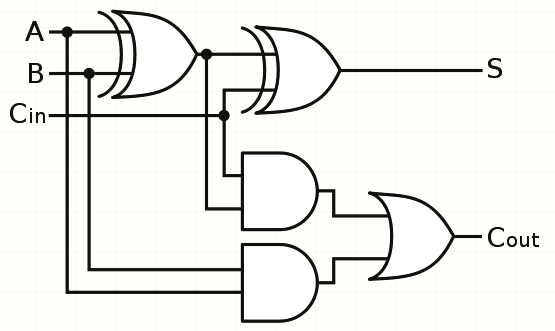
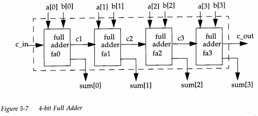

## 🧮 4-Bit Full Adder — Introduction

A **4-bit full adder** is a digital circuit that performs the arithmetic operation of addition on two 4-bit binary numbers. It’s constructed by cascading four single-bit full adders, allowing it to compute the **sum** and **carry** of each corresponding pair of bits from two binary numbers, along with an optional carry-in input.

It's essential in building arithmetic logic units (ALUs) and is widely used in digital systems where binary computation is required.

---

## ⚙️ Inputs and Outputs

- **Inputs:**
  - **A₃ A₂ A₁ A₀** – First 4-bit binary number
  - **B₃ B₂ B₁ B₀** – Second 4-bit binary number
  - **Cin** – Carry input (optional, typically 0 in unsigned addition)

- **Outputs:**
  - **S₃ S₂ S₁ S₀** – 4-bit Sum output
  - **Cout** – Final carry out from the most significant bit

---
## Equation

For each bit position i (from 0 to 3), where:

Aᵢ and Bᵢ are the input bits

Cᵢ is the carry-in for that stage

Sᵢ is the sum output

Cᵢ₊₁ is the carry-out to the next stage

The equations are:

> Sum (Sᵢ) = Aᵢ ⊕ Bᵢ ⊕ Cᵢ

> Carry-out (Cᵢ₊₁) = (Aᵢ · Bᵢ) + (Cᵢ · (Aᵢ ⊕ Bᵢ))

Here:

⊕ is the XOR (exclusive OR) operator

· is the AND operator

+is the OR operator

---

## circuit diagram

---
### code:
codes for the implementaion of the 4:1 mux digital circuit is also provided alongside with the stimulus or testbench code.

test_bench code : 
[testbench or stimulus code for 4 bit full adder](fulladdr4_tb.v) 

mux 4:1 code : 
[4bit full adder implementation ](fulladdr4.v)

---

### thank you for reading !!
