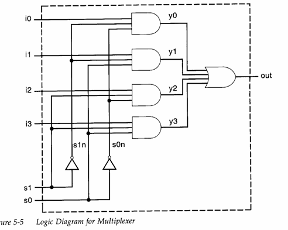

# 4:1 Multiplexer

---

## Introduction

A **4:1 multiplexer** (or 4-to-1 MUX) is a digital switch that channels one of four input signals to a single output line, based on the values of two control (or select) inputs. Think of it as a signal selector: at any given time, only *one* of the four inputs is routed to the output, depending on the binary value of the select lines.

---

## ⚙️ Inputs and Output

- **Data Inputs (I₀, I₁, I₂, I₃)**: Four separate binary inputs
- **Select Inputs (S₀, S₁)**: Two control lines to select one of the four inputs
- **Output (out)**: The resulting output that reflects the selected data input

---

## 📋 Truth Table

```markdown
| S₁ | S₀ | Output out |
|----|----|----------|
| 0  | 0  | I₀       |
| 0  | 1  | I₁       |
| 1  | 0  | I₂       |
| 1  | 1  | I₃       |

```

Each row shows which data input gets passed through to the output **Y** based on the values of the select lines **S₁** and **S₀**.

---

### Image


---
### code:
codes for the implementaion of the 4:1 mux digital circuit is also provided alongside with the stimulus or testbench code.

test_bench code : 
[testbench or stimulus code for the 4:1 mux](mux4_1_tb.v) 

mux 4:1 code : 
[4:1 mux implementaion in verilog ](mux4_1.v)

### thank you for reading !!