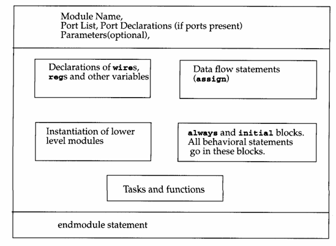

# day 3-Module,ports and operators

---

## Module

- As we studied that modules are the basic building block and see that module can be initalised or defined and create instantiation of that modules.
- a module contains the name of the module , list of the input and output ports and inside it contains the implemention of the logic.
- A module always start with the keyword module and ends with the keyword endmodule.



- so apart from the module, endmodule and module name everything is optional. Inside the module block we have variable declaration ,data flow statements ,instantiation of other module and behavioural statements etc, that make things work.

example- 


```verilog
module sr_latch(Q,Qbar,Sbar,Rbar);
output Q, Qbar;//port declaration as output 
input  Sbar,Rbar;// port declaration as input

nand n1(Q,Sbar,Qbar);
nand n2(Qbar,Rbar,Q);
endmodule

module top;

wire q,qbar; 
reg set, reset;
//instantiate the sr latch here and give the inputs by the wires and regs variables
sr_latch m1(q,qbar,~set,~reset);
initial begin
		$monitor($time ,"set=%b,reset=%b,q=%b\n",set,reset,q);
		set=0;reset=0;
		#5 reset=1;
		#5 reset=0;
		#5 set=1;
end 
endmodule 
```

---

## Ports

- for environment to interact with the module we need port, they are the input/output pins and they are interface.
- so for example you can see in above code, that we instantiated the sr_latch module inside the module top, and the module top provides the inputs and take output throught the instantiated module and module top doesnt have any port lists.

### Ports declaration

| verilog keyword  | type  |
| --- | --- |
| input  | input port |
| output  | output port  |
| inout | bidirectional port  |

### Port decalration rules :


- **inputs** - internally input ports must be of the type net. externally the inputs can be connected to a reg or net.
- **ouputs** - internally output can be of type wire or reg. externally outputs must be always connected to a net, the reason is that net or wire are continously changing and reg is used to hold a value. so you cant have your output to be a reg.
- **inouts** - internally or externally the inout ports must always be nets or wire.
- verilog allows the ports to be unconnected and you can connects the internal and external item of different widths.

| type  | input  | output | inout |
| --- | --- | --- | --- |
| internal | net | net or reg | net |
| external | reg/net | net | net  |

### Connection rules for ports to external signals

1. **connecting by order lis**t : here you have to connect the signals in same orders as they are defined in module defination.

```verilog
module Top;
reg[3:0] a,b;
reg c_in;
wire [3:0] sum;
wire c_out;
// you connect this in the module instance as how they are defined
fulladdr4 fa_ordered(sum,c_out,a,b,c_in);
//<stimulus>
endmodule
//module defination
module fulladdr4(SUM,C_OUT,A,B,C_IN);
.
.
.
endmodule 
```

1. **connecting ports by name** : for larger design , remembring the correct order might be hassle,for that you can use this rule.

```verilog
fulladd4 fa_byname(.C_OUT(c_out),.C_IN(c_in),.SUM(sum),.A(a),.B(b));
//here you can do this in any order and you can just let unconnected ports and dont connect them with anything.
```

## **Hierarchical Names in Verilog**

1. **What Is a Hierarchical Name?**
    - A way to uniquely refer to any instance, signal, or variable in a multi‑level design.
    - Built by concatenating module and instance names (and signal names) with dots (`.`).
2. **Root Module**
    - The top‑level module in your simulation (often called `stimulus` or similar) that isn’t instantiated by anything else.
    - All other modules and signals hang below it in the hierarchy.
3. **Design Hierarchy**
    - Each module instance instantiates its own child modules.
    - Example hierarchy (for an SR latch testbench):
        
        ```
        stimulus        ← root
         └─ m1 (SR_latch)
             ├─ n1 (nand)
             └─ n2 (nand)
        
        ```
        
4. **Referencing Signals**
    - To reference a signal or port in a nested instance, use the full path:
        
        ```
        stimulus.qbar
        stimulus.m1.n2.Q
        stimulus.m1.set
        
        ```
        
    - You can go as deep as needed: each “.” steps one level down.
5. **Using in `$display`**
    - Verilog lets you include the special `%m` format in `$display` to print an identifier’s **current hierarchical path** automatically.
    - E.g.:
        
        ```verilog
        $display("%m: value = %b", stimulus.m1.Q);
        // may print: stimulus.m1.Q: value = 1
        ```
