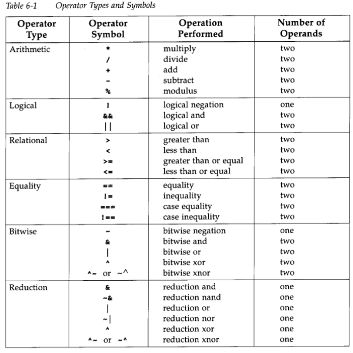
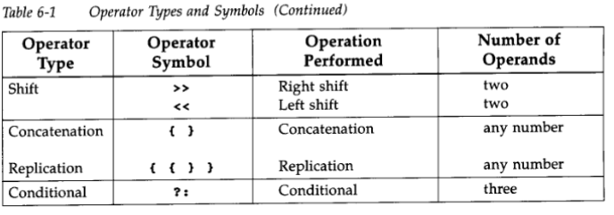

#  Data flow modelling 

- so in the previous note we learned the gate level modelling, where we instansiate various gates and connected them accrodingly as per the circuit or the logic diagram , and genreally the gate level modelling is easy for people new to the digital logic design, but tends to make the code lenghty. so we use another higher level of abstraction which concerns with the flow of data between the registers.
- currently as with increasingly gate densities on chips ,data flow modelling is  of great importance. as automated tools are used to create a gate-level circuit from a dataflow desgin description. This process is called **logic synthesis**.
- In vlsi, for the maximum flexiblity in the design process,designer usesa verilog description style that combines gate-level,data flow and behvioural design and a term **RTL(register transfer level)** is used for the combination of dataflow and behvioural modelling.

---

## Continous assignments

```verilog
<continous_assign> ::= assign <drive_strength>?<delay>?<list_of_assignments>;

```
- **drive strength** is optional here and default value is either strong0 and strong1.
- **delay specifications** is for the gates delay and also optional, used for the assign statement delay.
- left hand side of the assignment should always be scalar or vector net,**but not the register**!!
- continous assignment are active and the value is assigned as the value of the operands on the right hand side changes and **the operands on the right hand side can be registers**.

```verilog
//examples 

//continous assign, out is a net. i1 and i2 are nets.
wire out;
assign out = i1 & i2 ;
//vs               above and below code are same thing 
wire out = i1 & i2 ; //implicit continous assignment

//addr1 and addr2 are vector registers and addr is 16 bit vector net
assign addr[15:0]= addr1_bits[15:0]^addr2_bits[15:0];

assign (c_out,sum[3:0])=a[3:0]+b[3:0]+c_in;
```
---
## Delay

we know what a delay is  and delay here control the time between the change in right hand side operand  and when the new value is assign to the left hand side.

three ways of speciifying delay in continous assignments :
1. **Regular assignment delay** : in this delay value is specified after the keyword assign. In this  any changes in the value in i1 and i2 waits 10 time unit before the recomputation i1 & i2 happens and result propogates to out. if any values i1 and i2 changes before 10 time unit, that is before the result propogates to the out. the value at the time of recomputation is considered, this property of is known as inertial delay.

```verilog 
assign #10 out = i1&i2; //delay in continous assign 

```
2. **Implicit continous assignment delay** : this uses the implicit continous assignment for both delay and assignment of the net.

```verilog 
wire out;
assign #10 out =i1&i2;
//same as 
wire #10 out =i1&i2; //implicit continuous assignment delay
```
3. **Net declaration delay** : here in this type we declare the delay at the time of net declaration and any assignment follows the same delay.

```verilog
wire #10 out;
assign out =i1&i2;
```
---
- experssion, operators and operands are generally we know what they are but in short we can say, an experssion consists of the operands(any variable or data types) and operators(and,or etc), where operators acts on the operands to produce some results.
---

## Types of operators



---
## Use cases of the operators 

Below is a collection of tiny Verilog snippets showing each operator in action. Each block uses a simple `initial`–`$display` to show how the operator behaves.

---

### 1. Arithmetic Operators (`* / + - %`)

```verilog
module arithmetic_ops;
  reg [3:0] a = 4’d9, b = 4’d5;
  initial begin
    $display("a=%0d, b=%0d", a, b);
    $display("a + b = %0d", a + b);
    $display("a - b = %0d", a - b);
    $display("a * b = %0d", a * b);
    $display("a / b = %0d", a / b);
    $display("a %% b = %0d", a % b);
    $finish;
  end
endmodule
```
```bash
output
a=9, b=5
a + b = 14
a - b = 4
a * b = 13
a / b = 1
a % b = 4
```


---

### 2. Logical Operators (`! && ||`)

```verilog
module logical_ops;
  reg p = 1, q = 0;
  initial begin
    $display("p=%b, q=%b", p, q);
    $display("!p = %b", !p);
    $display("p && q = %b", p && q);
    $display("p || q = %b", p || q);
    $finish;
  end
endmodule
```
```bash
output
p=1, q=0
!p = 0
p && q = 0
p || q = 1
```


---

### 3. Relational Operators (`> < >= <=`)

```verilog
module relational_ops;
  reg [3:0] x = 4'd7, y = 4'd9,z=4'b00xx;
  initial begin
    $display("x=%0d, y=%0d", x, y);
    $display("x >  y = %b", x >  y);
    $display("x <  y = %b", x <  y);
    $display("x >= y = %b", x >= y);
    $display("x <= y = %b", x <= y);
    $display("x <= z = %b", x <= z);
    $finish;
  end
endmodule
```
```bash
output
x=7, y=9
x >  y = 0
x <  y = 1
x >= y = 0
x <= y = 1
x <= z = x
```
- **note**: any operation with the unknown number x , will result in x.

---

### 4. Equality Operators (`== != === !==`)

```verilog
module equality_ops;
  reg [1:0] a = 2'bx1, b = 2'b01;
  initial begin
    $display("a=%b, b=%b", a, b);
    $display("a ==  b = %b", a ==  b);  // logical equality ('x' treated as unknown)
    $display("a !=  b = %b", a !=  b);
    $display("a === b = %b", a === b);  // case equality (bit‑exact)
    $display("a !== b = %b", a !== b);
    $finish;
  end
endmodule
```
```bash
output
a=x1, b=01
a ==  b = x
a !=  b = x
a === b = 0
a !== b = 1
```


---

### 5. Bitwise Operators (`~ & | ^ ^~`)

```verilog
module bitwise_ops;
  reg [3:0] d = 4'b1010, e = 4'b0110;
  initial begin
    $display("d=%b, e=%b", d, e);
    $display("~d      = %b", ~d);
    $display("d & e   = %b", d & e);
    $display("d | e   = %b", d | e);
    $display("d ^ e   = %b", d ^ e);
    $display("d ^~ e  = %b", d ^~ e);
    $finish;
  end
endmodule
```
```bash
output
d=1010, e=0110
~d      = 0101
d & e   = 0010
d | e   = 1110
d ^ e   = 1100
d ^~ e  = 0011
```


---

### 6. Reduction Operators (`& ~& | ~| ^ ~^`) 
- in this the individual bits in the digit is acted by the respective operands.

```verilog
module reduction_ops;
  reg [3:0] v = 4'b1101;
  initial begin
    $display("v = %b", v);
    $display("&v  = %b", &v);   // reduction AND  1&1&0&1 results in 0
    $display("~&v = %b", ~&v);  // reduction NAND 
    $display("|v  = %b", |v);   // reduction OR   1|1|1|1 results in 1
    $display("~|v = %b", ~|v);  // reduction NOR
    $display("^v  = %b", ^v);   // reduction XOR
    $display("~^v = %b", ~^v);  // reduction XNOR
    $finish;
  end
endmodule
```
```bash
output
v = 1101
&v  = 0
~&v = 1
|v  = 1
~|v = 0
^v  = 1
~^v = 0
```


---

### 7. Shift Operators (`<< >>`)

```verilog
module shift_ops;
  reg [3:0] s = 4'b0011;
  initial begin
    $display("s = %b", s);
    $display("s << 1 = %b", s << 1); // left shift operation << , 0 is asserted in lsb side or the bits are displaced by 1 bit to the left.
    $display("s >> 2 = %b", s >> 2);//right shift operation >. , 0 is asserted in msb side or the bits are displaced by 1 bit to the right.
    $finish;
  end
endmodule
```
```bash
output
s = 0011
s << 1 = 0110
s >> 2 = 0000
```

---

### 8. Concatenation (`{ }`) & Replication (`{N{…}}`)

```verilog
module concat_repl;
  reg [1:0] a = 2'b10, b = 2'b01;
  initial begin
    $display("{a, b}       = %b", {a, b});       // concatenation
    $display("{3{1'b1}}    = %b", {3{1'b1}});    // replication of 1 three times
    $display("{2{a, b}}    = %b", {2{a, b}});    // replication of the concatenation
    $finish;
  end
endmodule
```
```bash
output
{a, b}       = 1001
{3{1'b1}}    = 111
{2{a, b}}    = 10011001
```
---

### 9. Conditional Operator (`?:`)

```verilog
module conditional_op;
  reg sel = 0;
  reg [3:0] u = 4'd5, v = 4'd9;
  wire [3:0] out;
  
  assign out = sel ? u : v;
  
  initial begin
    $display("sel=%b => out=%0d", sel, out);
    sel = 1;
    #1; // wait a time unit
    $display("sel=%b => out=%0d", sel, out);
    $finish;
  end
endmodule
```
```bash
output
sel=0 => out=x
sel=1 => out=5
```


---

## Operators precedence in verilog 
- so if in any expression there is no brackets seperating the expression, then the following operators precedence is taken by verilog for the evaluation of the result.

| Operators                 | Operator Symbols   | Precedence         |
| ------------------------- | ------------------ | ------------------ |
| Unary                     | `+ - ! ~`          | Highest precedence |
| Multiply, Divide, Modulus | `* / %`            |                    |
| Add, Subtract             | `+ -`              |                    |
| Shift                     | `<< >>`            |                    |
| Relational                | `< <= > >=`        |                    |
| Equality                  | `== != === !==`    |                    |
| Reduction                 | `& ~& ^ ~^ \| ~\|` |                    |
| Logical                   | `&& \|\|`          |                    |
| Conditional               | `?:`               | Lowest precedence  |


---

##  thank you for reading !!