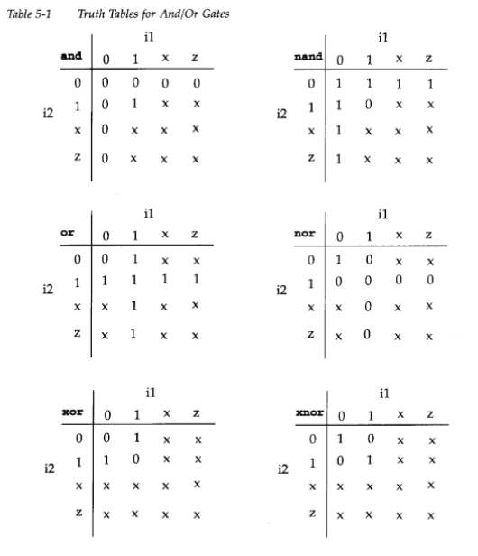

# day3.2 gate level modelling

- so the lowest level of the abstraction is the swtitch(transistor) level modellin, in which we design the digital circuit on the basis of the transistor, but its more complex for the larger circuits, so we choose the another level of the abstraction (low) that is gate level, here the beginners or the person design circuits using the basic gates like and, nand etc.
- in verilog the basic gates are predefined as primitives and dont need the module defination and can be easily instantiated.
- there are two type of the basic gates :
1. **AND/OR GATES** : these ones have one scalar output and multi inputs, and the first terminal in the list is the output while the rest is the inputs.
- in this type : and, or ,xor ,nand , nor, xnor are the basic gates.

```verilog
wire OUT,IN1,IN2;
and AND1(OUT,IN1,IN2); 
nor nor1(OUT,IN1,IN2);
//AS IN ABOVE CASES WE WROTE THE INSTANCE NAME AS WELL BUT THE INSTANCE NAME IS OPTIONAL FOR THE PRIMITIVE AS RHE OUTPUT WILL BE STORED IN THE OUT.
and (OUT,IN1,IN2);// VALID GATE INSTANCE WITHOUT THAT ISNTANCE NAME 
and (OUT,IN1,IN2,IN3); // 3 INPUT AND GATE 
```



note - above is the truth table for the and/or types gate and the result evaluated, the gates only computes the output when any of the input changes.

1. **buf/not gates** : these gates have one scalar input and more than one output. and the last terminal in the list is the input in module.
- two basic gates : buf , not .


```verilog
//SINGLE OUTPUT
buf b1(OUT,IN);
not n1(OUT,IN);
//MULTI OUT
buf b1_2out(OUT1,OUT2,IN);
not (OUT,IN);//LEGAL ,NO INSTANCE NAME 
```


note - one thing is to be noted the output never evaluates to be z but x (unknown).

- **bufif/notif** : gates with the additional control signal on buf and not ,i.e gate propogates only when there control signal is  asserted.
- they are instantiated the same way as the other , with the first terminal in the list being output , input and then control signal.


```verilog
bufif1 b1(out,in,ctr1);
notif0 n0(out,in,ctrl);
```

## Dealy in logic circuits

- in logic circuits, there is a propogation delay, pin to pin delay and other miscelleneous delays.
- there are generally three kind of dealys in the circuits:
1. **rise delay** : the delay or time taken for the value to change from any other value other than 1 to the 1.
2. **fall delay** : time taken for the output to fall from the any other value such as x,z or 1 to the logic 0.
3. **turn off delay** : the time taken for the output transition to the high impedance value z.
- if one delay value is specified like #(delay_time) then this value is used for all transistions and if two values of the delay are specified then they refer to the rise and fall delays and the turnoff delay are considered as minimum of the two delay and if 3 delays  are specified they refer to the rise,fall and turn off delay.

```verilog
//this delay is used for the all transistions
and #(delay_time) (out,i1,i2);
//rise and fall dealy specificaiton
and #(rise_val,fall_val) (out,i1,i2);
//rise,fall and turnoff delay specification
and #(rise_val,fall_val,turnoff-val) (out,i1,i2);
```

## Min/Typ/Max Values

- for each type of dely rise, fall and turn off - three values min,typ, and max can be specified.
- **min** - minimum delay value that designer expect the gate to have.
- **max** - the maximum delay value that designer expects to have.
- **typ** - the typical value of the delay the designer expects.
- min,typ or max values can be chosen at  verilog run time.

```verilog
// one delay specified 
// if +mindelay, delay =4
// if +typdelay, delay =5
//if +max delay, delay =6
and #(4:5:6) (out,i1,i2);

// two delay specified 
// if +mindelay, rise =3 ,fall =5 ,turnoff = min(3,5)
// if +typdelay, rise =4 ,fall =6 ,turnoff = min(4,6)
//if +max delay, rise =5 ,fall =7 ,turnoff = min(5,7)
and #(3:4:5,5:6:7) (out,i1,i2);

// one delay specified 
// if +mindelay, rise =2 ,fall =3 ,turnoff = 4
// if +typdelay, rise =3 ,fall =4 ,turnoff = 5
//if +max delay, rise =4 ,fall =5 ,turnoff = 6
and #(2:3:4,3:4:5,4:5:6) (out,i1,i2);
//to invoke simulation with minimum delay
//note those delays must be specified in the .v file 
> verilog test.v +mindelays
```